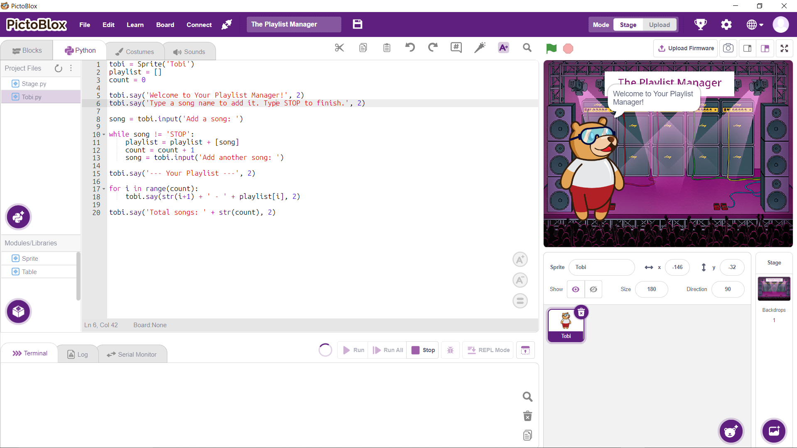
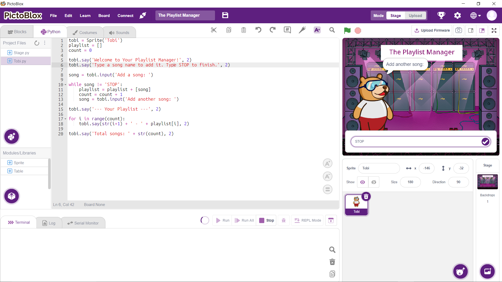
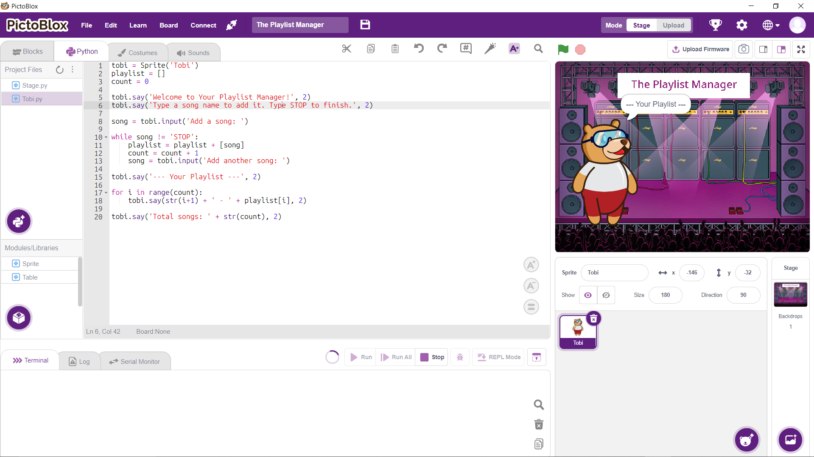

# The Playlist Manager

## Overview

The Playlist Manager is a hands-on programming activity designed for students in the Digital Egypt Cubs Initiative (DECI) Level 1 General Track.

In this activity, students build a simple playlist management application using PictoBlox Python Mode. The program allows users to enter song names one by one, stores them in a playlist, and displays a numbered list of all songs when the user types `STOP`.

The activity emphasizes Computational Thinking, Algorithm Design, and collaborative problem-solving before writing code.

---

## Learning Objectives

By completing this activity, students will be able to:

* Apply Computational Thinking concepts such as Decomposition and Algorithm Design.
* Design a solution using pseudocode before coding.
* Use variables to store and update data.
* Use lists to manage multiple values.
* Use a `while` loop to repeat actions until a stop condition is met.
* Use a `for` loop with `range()` to display organized output.
* Collaborate effectively through assigned team roles.

---

## Problem Statement

Students are asked to create a Playlist Manager that:

1. Welcomes the user.
2. Allows the user to enter song names.
3. Stores songs inside a playlist.
4. Stops accepting songs when the user enters `STOP`.
5. Displays all songs as a numbered playlist.
6. Displays the total number of songs added.

---

### Decomposition Questions

* What information should be stored?
* How can songs be collected from the user?
* When should the program stop asking for songs?
* How should the playlist be displayed?
* How can the total number of songs be calculated?

### Sample Pseudocode

```text
Create an empty playlist
Set song count to 0

Ask the user for a song

While the song is not STOP:
    Add song to playlist
    Increase count
    Ask for another song

Display playlist title

For each song in playlist:
    Display song number and name

Display total number of songs
```

---

## Concepts Covered

### Variables

Used to track the total number of songs.

```python
count = 0
```

### Lists

Used to store playlist items.

```python
playlist = []
```

### While Loop

Used to repeatedly ask the user for songs until STOP is entered.

```python
while song != 'STOP':
```

### For Loop

Used to display songs with numbering.

```python
for i in range(count):
```

---

## Full Solution

```python
tobi = Sprite('Tobi')

playlist = []
count = 0

tobi.say('Welcome to Your Playlist Manager!', 2)
tobi.say('Type a song name to add it. Type STOP to finish.', 2)

song = tobi.input('Add a song: ')

while song != 'STOP':
    playlist = playlist + [song]
    count = count + 1
    song = tobi.input('Add another song: ')

tobi.say('--- Your Playlist ---', 2)

for i in range(count):
    tobi.say(str(i + 1) + ' - ' + playlist[i], 2)

tobi.say('Total songs: ' + str(count), 2)
```

---

## Example Output

```text
Welcome to Your Playlist Manager!

Add a song: Blinding Lights
Add another song: As It Was
Add another song: STOP

--- Your Playlist ---

1 - Blinding Lights
2 - As It Was

Total songs: 2
```

---

## Team Roles

### Analyst

* Breaks down the problem.
* Creates pseudocode.
* Explains the logic.

### Coder

* Implements the solution in PictoBlox Python Mode.
* Follows the planned algorithm.

### Tester

* Runs the program.
* Identifies bugs and logic errors.
* Verifies the final output.

---

## Technologies Used

* PictoBlox
* Python Mode
* Tobi Sprite

---

## Project Screenshots

### Screenshot 1


### Screenshot 2


### Screenshot 3


### Screenshot 4


---

## Digital Egypt Cubs Initiative (DECI)

Level 1 – General Track

Prepared for instructional and educational purposes.
