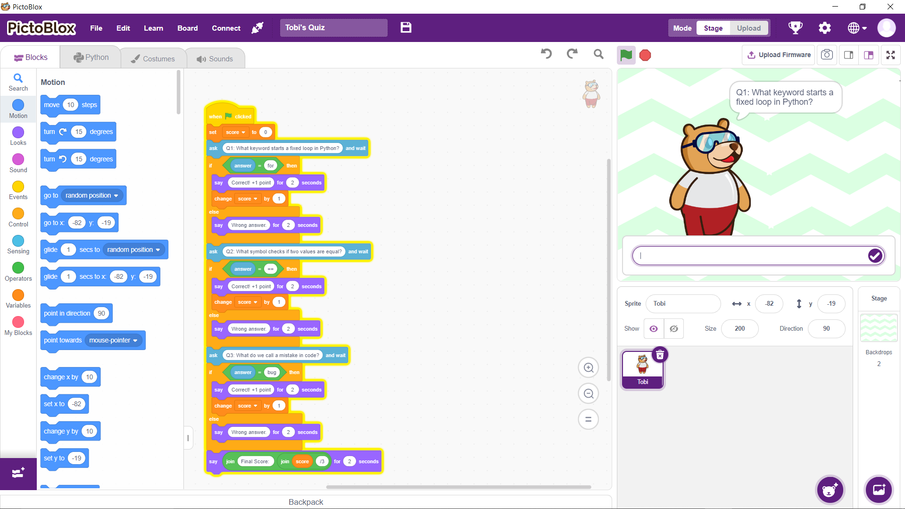
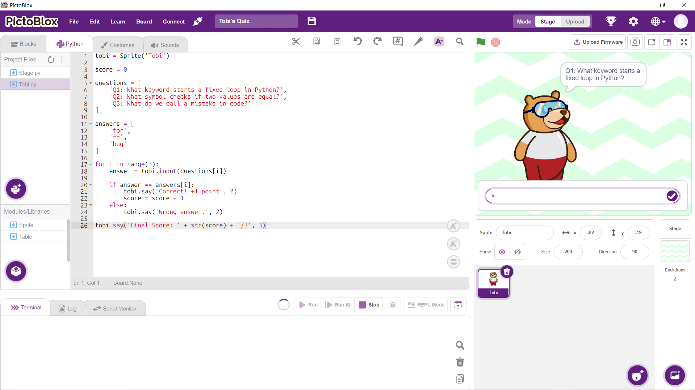
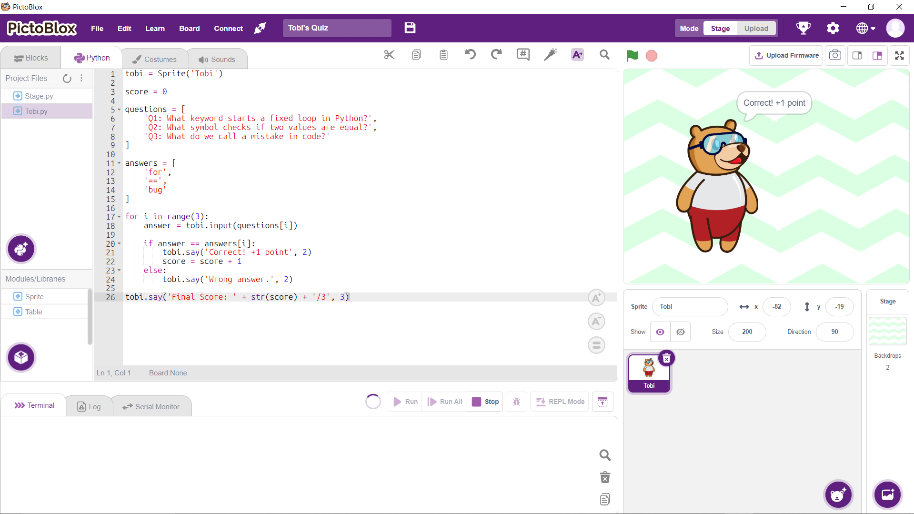

# Tobi's Coding Quiz

## Overview

Tobi's Coding Quiz is an interactive programming activity developed for the Digital Egypt Cubs Initiative (DECI) Level 1 General Track.

In this activity, students build the same quiz application twice:

1. Using Block-Based Programming in PictoBlox.
2. Using Text-Based Python Programming.

Students discover that both approaches follow the same logic and problem-solving process, even though they are written differently.

Tobi acts as the quiz host by asking programming-related questions, evaluating answers, providing instant feedback, and displaying the final score.

---

## Learning Objectives

By completing this activity, students will be able to:

* Build an interactive quiz using Block-Based Programming.
* Convert a block-based solution into Python code.
* Use variables to track scores.
* Apply conditional statements (`if/else`) to evaluate answers.
* Use lists to organize quiz questions and answers.
* Use a `for` loop with `range()` to automate repetitive tasks.
* Understand that the same algorithm can be represented visually or textually.
* Collaborate effectively within a team.

---

## Activity Description

Students create a coding quiz hosted by Tobi.

The quiz:

1. Asks three programming questions.
2. Receives user answers.
3. Checks each answer.
4. Awards points for correct answers.
5. Displays immediate feedback.
6. Shows the final score at the end.

The activity is completed in two phases:

### Phase 1 – Block-Based Programming

Students build the quiz using PictoBlox blocks.

### Phase 2 – Text-Based Python Programming

Students recreate the same quiz using Python Mode.

---

## Concepts Covered

### Variables

Used to track the player's score.

```python
score = 0
```

### Lists

Used to store questions and answers.

```python
questions = [...]
answers = [...]
```

### For Loop

Used to ask all quiz questions automatically.

```python
for i in range(3):
```

### Conditional Statements

Used to check whether the answer is correct.

```python
if answer == answers[i]:
```

### User Input

Used to receive answers from the player.

```python
answer = tobi.input(...)
```

---

## Python Solution

```python
tobi = Sprite('Tobi')

score = 0

questions = [
    'Q1: What keyword starts a fixed loop in Python?',
    'Q2: What symbol checks if two values are equal?',
    'Q3: What do we call a mistake in code?'
]

answers = [
    'for',
    '==',
    'bug'
]

for i in range(3):
    answer = tobi.input(questions[i])

    if answer == answers[i]:
        tobi.say('Correct! +1 point', 2)
        score = score + 1
    else:
        tobi.say('Wrong answer.', 2)

tobi.say('Final Score: ' + str(score) + '/3', 3)
```

---

## Example Output

```text
Tobi asks: Q1: What keyword starts a fixed loop in Python?
Student types: for

Tobi says: Correct! +1 point

Tobi asks: Q2: What symbol checks if two values are equal?
Student types: =

Tobi says: Wrong answer.

Tobi asks: Q3: What do we call a mistake in code?
Student types: bug

Tobi says: Correct! +1 point

Tobi says: Final Score: 2/3
```

---

## Team Roles

### Block Builder

* Creates the quiz using PictoBlox blocks.
* Implements variables, conditions, and questions.

### Python Coder

* Recreates the same logic in Python Mode.
* Ensures the text-based version matches the block version.

### Tester

* Tests both versions.
* Verifies score calculation.
* Identifies logic and syntax errors.

---

## Technologies Used

* PictoBlox
* Block-Based Programming
* Python Mode
* Tobi Sprite

---

## Project Screenshots

### Block-Based Version



### Python Version





---

## Digital Egypt Cubs Initiative (DECI)

Level 1 – General Track

Prepared for instructional and educational purposes.
